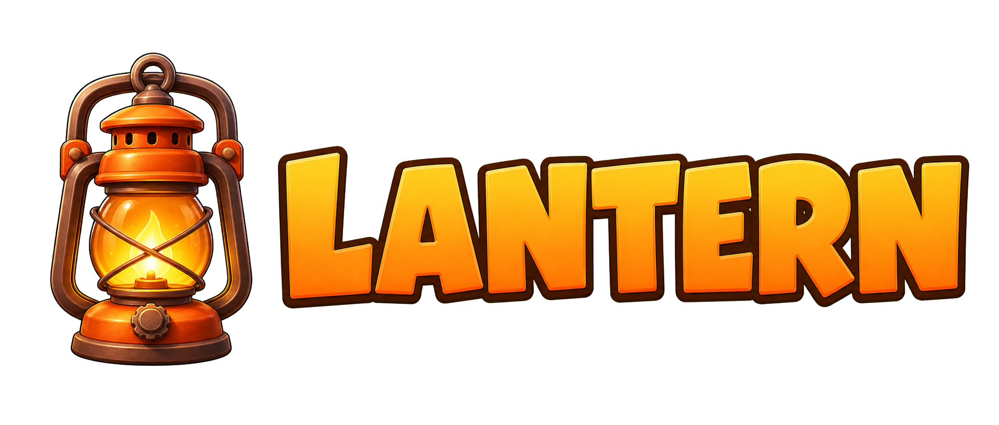
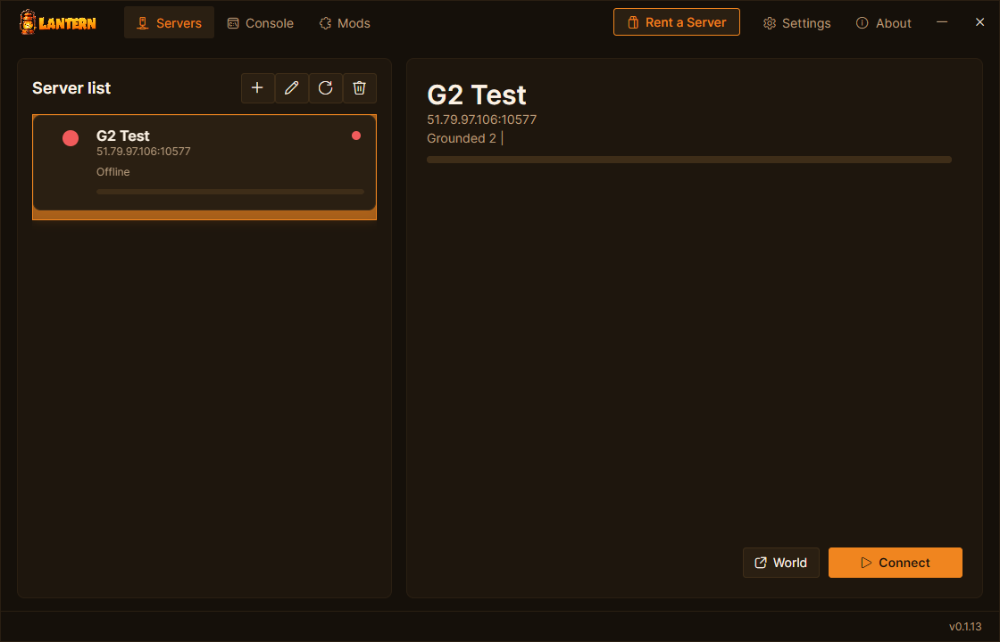

  <picture>
    <source media="(prefers-color-scheme: dark)" srcset="docs/img/lantern-lockup-dark.png">
    
  </picture>

  
  
  

# Lantern

Lantern gives **Grounded 2** IP/port multiplayer: players join through the Lantern desktop app, hosts run a Lantern server package next to Grounded 2, and worlds stay on the server with snapshots, admin tools, server query, and a mod kit. No friend-code lobby, no peer-to-peer handoff, no host-must-be-online requirement.

Every player must install Lantern to join a Lantern server. Stock Grounded 2 cannot connect to Lantern servers directly.

  

## Features

### 🏮 Join by IP and port
Add a server address once, pick your character, and connect straight into the hosted world.

### 🌐 Stock UE networking
Lantern joins through plain Unreal IpNetDriver UDP — no Xbox sign-in, no platform party, no friend codes.

### 💾 Server-side worlds
The world lives on the host machine. The server keeps running after a player leaves, and snapshots give admins a recovery point before major changes.

### 🔁 Snapshots and rollback
Admins can take snapshots, list saved worlds, and restore a previous world from Lantern's world tools or RCON.

### 🧑‍🤝‍🧑 Multiple characters
Players can keep separate characters per server. Lantern remembers the character you used for each saved server.

### 🛠 Admin console
LanternServer exposes Source RCON on the server's RCON port for commands like `help`, `status`, `players`, `save snapshot`, and `save list`.

### 📡 Server query
LanternServer answers Source A2S query so server lists, monitoring tools, and bots can read status and player counts.

### 🧩 Mods + ModKit
Lantern loads Lua and C++ mods through UE4SS on both the client and the host. See [docs/MODS.md](docs/MODS.md).

## Install

### Managed hosting
The shortest path is [SurvivalServers.com Grounded 2 hosting](https://www.survivalservers.com/services/game_servers/grounded_2/?utm_source=github&utm_medium=readme_install&utm_campaign=lantern). Lantern is already installed, ports are handled, and the panel shows a one-click Lantern setup link for players.

### Players
1. Download `LanternSetup-<version>.exe` from the [latest release](https://github.com/HumanGenome/Lantern/releases/latest).
2. Run the installer. Windows SmartScreen may warn because the installer is not code-signed yet; choose **More info** then **Run anyway**.
3. Open Lantern, add the server address, select or create a character, and click **Connect**.

Lantern checks for launcher updates automatically on launch and while it is running.

### Self-hosted servers
1. Download `Lantern-Server-Windows-x64-v<version>.zip` from the [latest release](https://github.com/HumanGenome/Lantern/releases/latest).
2. Extract it on the Windows host.
3. Edit `LanternServer\appsettings.json`.
4. Forward/open the gameplay UDP port, query UDP port, RCON TCP port, and admin HTTP TCP port.
5. Run `LanternServer\LanternServer.exe`. The server runs headless — no GPU is required.

Full server setup, settings, source query examples, RCON commands, and build instructions live in [HumanGenome/LanternServer](https://github.com/HumanGenome/LanternServer).

## FAQ

### How do I join a server?
Open Lantern, click Add Server, and enter a name, the server's IP or hostname, and its gameplay port. Add the join key if the server uses one. Lantern derives the query, RCON, and admin ports from the gameplay port, so you only enter the one port. Select the server, pick or create a character, and click Connect.

### Can I run the server on the same machine I play on?
No. The Lantern server runs its own copy of Grounded 2 in the background and your game client runs a second copy, and Steam only allows one running instance of a game per account. Run the server on a separate host and connect to it from your gaming PC.

### Can I import an existing save?
Yes, from the server's world tools. The server takes a backup before importing and restarts on the imported world.

### Is Linux supported?
No. Lantern is Windows-only, for both the player app and the server (Windows 10/11/Server, 64-bit). The server launches the Windows build of Grounded 2 and uses Windows process management.

## Releases

The public release page is intentionally simple:

- `LanternSetup-<version>.exe` — installer for players
- `Lantern-Server-Windows-x64-v<version>.zip` — server package for hosts
- `checksums.txt` — hashes for the release assets

If you only want to play on someone else's server, you need the installer, not the server zip. Source archives are generated by GitHub automatically for tags.

## Development

The Lantern app, server, runtime plugin, installer, and release automation live in the build repo.

- `src/launcher/Lantern.Launcher` — Avalonia desktop app
- `src/server/LanternServer` — host supervisor, RCON, query, HTTP admin API
- `src/native/Lantern.Plugin` — UE4SS runtime plugin
- `installer` — NSIS installer
- `dist/ue4ss-client` and `dist/ue4ss-server` — runtime UE4SS layouts; the host mods live under `dist/ue4ss-server/Mods`, the client join mod under `dist/ue4ss-client/Mods`

## Source

LanternServer source is mirrored publicly at [HumanGenome/LanternServer](https://github.com/HumanGenome/LanternServer).

The public Lantern repo at [HumanGenome/Lantern](https://github.com/HumanGenome/Lantern) is the download and documentation hub for released builds.

## Community Note

Lantern is a community project and is not affiliated with or endorsed by the developers of Grounded 2.

## License

See [LICENSE](LICENSE).

## Credits

- [UE4SS](https://github.com/UE4SS-RE/RE-UE4SS) — Unreal Engine scripting and modding framework
- [Avalonia](https://avaloniaui.net/) — .NET UI framework used by Lantern
